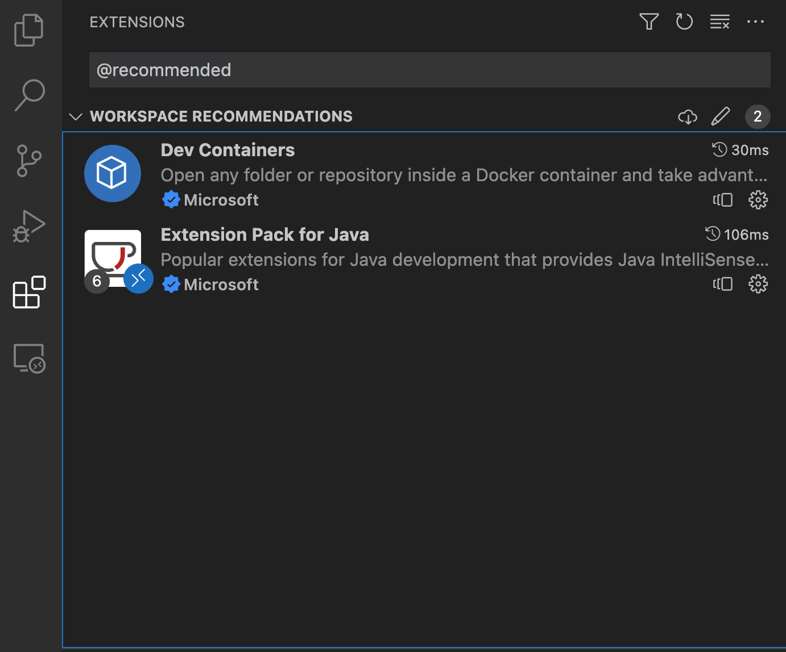

# OWASP SKF Java labs

This version of the OWASP SKF Labs is adapted for VSCode Dev Containers and can be run using only VSCode.

## VSCode extensions needed

1. `Dev Containers`: build and run the vulnerable apps in a container
2. `Extension Pack for Java`: Extension Pack for Java is a collection of popular extensions that can help write, test and debug Java applications in Visual Studio Code

